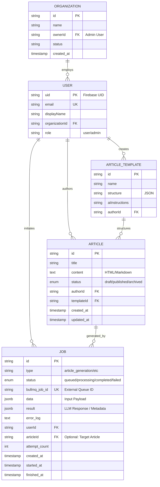

# Entity Relationship Diagram (ERD)

This document outlines the data model for the TaughtCode Server, emphasizing the "State-Driven" architecture required for the backend-only article generator using BullMQ.

## State-Driven Architecture

In this system, the **Job** entity is central to tracking the asynchronous lifecycle of AI content generation. Unlike a simple CRUD application, the state of a request is fluid.

- **Status Enum**: The `Job` table acts as the source of truth for the *process*, moving through `queued` -> `processing` -> `completed` (or `failed`).
- **Metadata**: JSONB fields (`data`, `result`) store the raw inputs for the LLM and the structured outputs, decoupling the generation logic from the final `Article` schema.
- **Observability**: Timestamps (`created_at`, `started_at`, `finished_at`) allow for performance monitoring of the queue system.

## Mermaid ERD

## Field Descriptions

### JOB Entity (The "State" Engine)
*   **status**: Critical for the frontend to poll or listen for updates.
*   **bullmq_job_id**: Links our internal record to the Redis/BullMQ instance, useful for debugging stuck jobs or killing processes.
*   **data**: Stores the prompt, selected template parameters, and user context *at the time of request*. This ensures reproducibility even if the user profile changes later.
*   **result**: Stores the raw output from the AI provider before it is parsed and saved into the `Article` table. This allows for re-processing logic without re-incurring AI costs.
