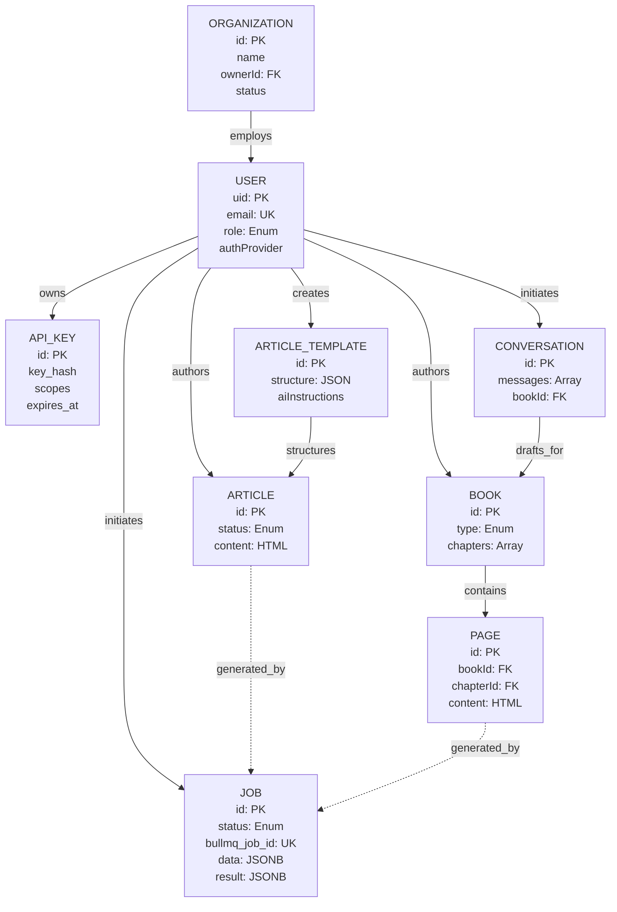
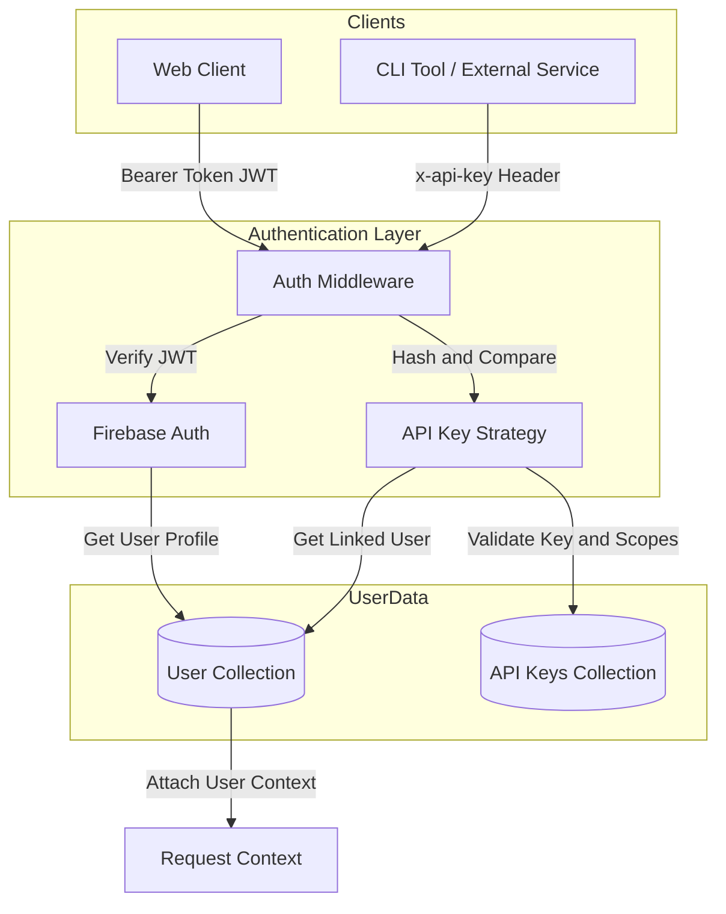
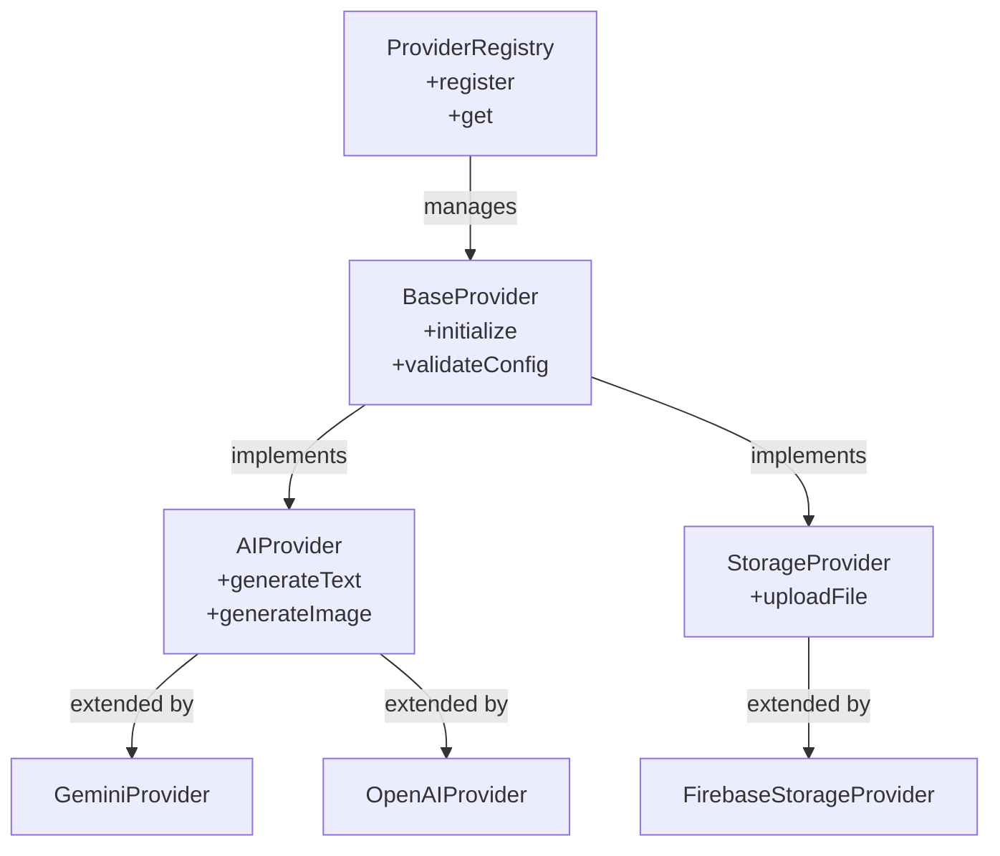
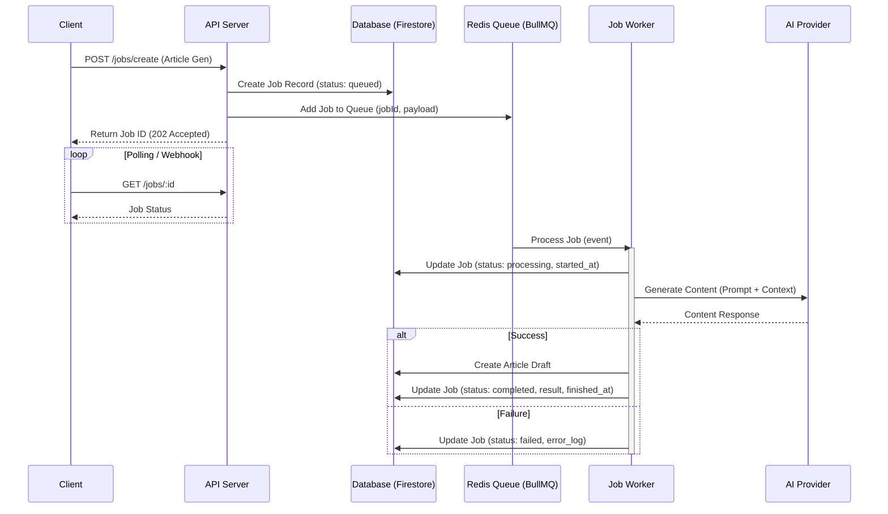
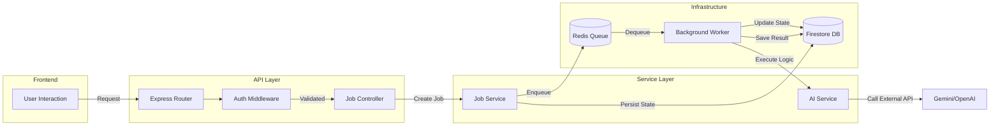

# Entity Relationship Diagram (ERD) & System Architecture

This document outlines the data model and architectural flows for the TaughtCode Server, emphasizing the "State-Driven" architecture required for the backend-only article generator using BullMQ.

## 1. Core Data Model (State-Driven)

In this system, the **Job** entity is central to tracking the asynchronous lifecycle of AI content generation. The `Job` table acts as the source of truth for the process, decoupling the generation logic from the final `Article` schema.

## 2. Authentication Architecture

The system supports dual authentication strategies: **User Interactive (OAuth/Firebase)** and **Machine-to-Machine (API Keys)**.

## 3. Provider System Pattern

We use a **Provider Pattern** to abstract external dependencies (AI, Storage, Auth), allowing for easy switching of vendors without changing business logic.

## 4. Job Processing & Service Workers

The **BullMQ** architecture ensures reliability for long-running AI tasks. It separates the API (Producer) from the background processing (Consumer).

## 5. System Data Flow

A high-level view of how a user request flows through the entire system.

